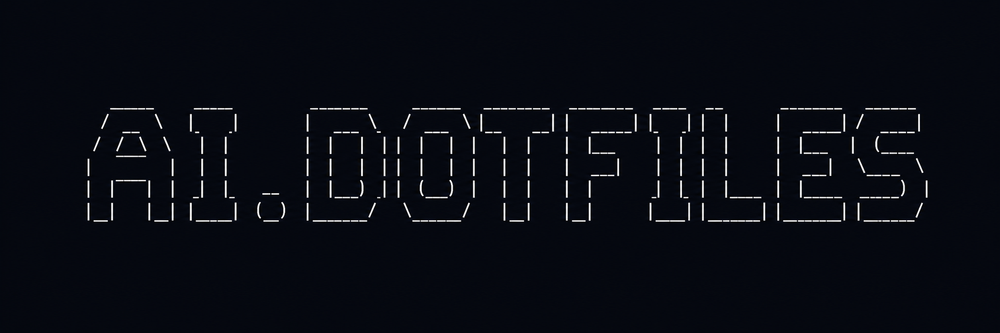

# ai-dotfiles

Personal [opencode](https://opencode.ai) configuration — agents, skills, MCPs, and a peer-programming workflow.

[📖 Read the docs](https://bdbch.github.io/ai-dotfiles/)

## Quick Install

```bash
sh ./installers/opencode.sh
```

This symlinks your opencode config to the repo and installs dependencies:

```
~/.config/opencode/
├── opencode.jsonc      → symlinked
├── opencode.base.json  → symlinked
├── AGENTS.md           → symlinked (instructions/README.md — the coding guidelines hub)
├── instructions/       → symlinked (split conventions: coding, design, docs, etc.)
├── agents/             → symlinked
├── skills/             → symlinked
└── .secrets/           → real dir (tokens stay out of repo)
```

See the [installation guide](https://bdbch.github.io/ai-dotfiles/install/) for full instructions.

## Agents

All agents live in [`agents/*.md`](agents/). Each file has YAML frontmatter with a `description`, `mode`, and `permission` settings. Browse the directory to see what's available.

To add a new agent, create a `.md` file in `agents/` following the `Category | Specialty` naming convention in the filename.

## Skills

All skills live in [`skills/*/SKILL.md`](skills/). Each provides a step-by-step workflow, checklists, and output format specs. Agents reference skills via `/skill-name` in their instructions.

To add a new skill, create a directory under `skills/` with a `SKILL.md` inside.

## MCP Integrations

Configured in `opencode.base.json`:

| Service | Status | Purpose |
|---------|--------|---------|
| Chrome DevTools | **Always on** | Browser automation for debug, design review, accessibility, testing |
| Linear | Opt-in | Issue tracking, project management |
| GitHub | Opt-in | PR review, issue management |
| Notion | Opt-in | Documentation, knowledge base |

## Workflow Rules

Run the installer after adding new agents or skills — symlinks pick them up automatically. No manual config updates needed.
